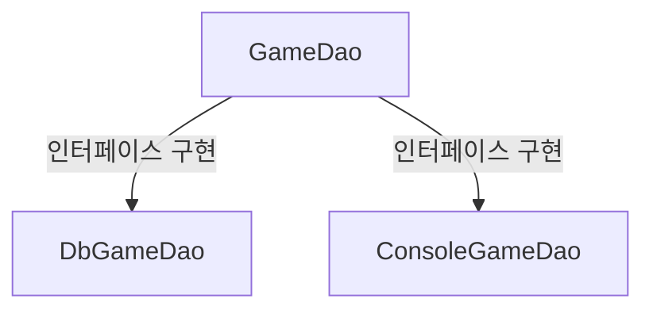

## 💋 문제 상황

요약: 같은 인터페이스를 구현한 스프링 Bean이 두 개 이상일 때, 어떻게 구분해서 의존성을 주입할 수 있을까?


인터페이스 구현한 두 가지 클래스를 빈으로 등록해서 사용하고 있는 상황...!




내가 사용하고 싶은 `@Service` 어노테이션이 붙은 클래스에서 자동으로 `GameDao`를 주입해주고 싶다.
그런데!

```java
@Service
public final class GameService {
    private final GameDao gameDao;

    public GameService(final GameDao gameDao) {
        this.gameDao = gameDao;
    }
}
```

나는 지금 `DbGameDao`가 스프링 DI 프레임워크를 통해서 주입되었으면 좋겠는데, 스프링은 `DbGameDao`와 `ConsoleGameDao` 둘 중 어떤 것을 주입해야 할지 모르겠다고 한다...! 


## 💋 문제 해결

### ✔ `@Qualifier` 어노테이션 이용해서 구분할 수 있다


`@Qualifier` 어노테이션을 붙여서 구분할 수 있다!

```
@Repository("dbGameDao")
public class DbGameDao implements GameDao {
    // ...
}

@Repository("consoleGameDao")
public class ConsoleGameDao implements GameDao {
    // ...
}
```

이렇게 `@Repository`에 이름을 설정해주고, 동일한 이름으로 `GameService`에서 구분할 수 있도록 `@Qualifier`를 넣어준다.
또 의존성 주입 시에 Bean의 이름을 같이 지정해서 어떤 빈을 주입할 지 명시할 수 있다. 

```
@Service
public class GameService {
    
    private final GameDao dbGameDao;
    private final GameDao consoleGameDao;
    
    public GameService(@Qualifier("dbGameDao") GameDao dbGameDao, 
                       @Qualifier("consoleGameDao") GameDao consoleGameDao) {
        this.dbGameDao = dbGameDao;
        this.consoleGameDao = consoleGameDao;
    }
    
    // ...
}
```


### ✔ `@Primary` 어노테이션을 이용해 우선적으로 사용할 빈을 지정할 수 있다.

```java
@Repository
@Primary // 우선적으로 사용할 빈 지정!
public class DbGameDao implements GameDao {
    // ...
}

@Repository
public class ConsoleGameDao implements GameDao {
    // ...
}

@Service
public class GameService {
    private GameDao gameDao;

    public GameService(GameDao gameDao) {
        this.gameDao = gameDao;
    }

    // ...
}
```

`GameService` 클래스에서 `GameDao` 타입의 의존성 주입 시, 자동으로 `@Primary` 어노테이션이 붙은 `DbGameDao` 객체가 주입된다.


### ✔ `@Resource` 어노테이션을 이용하여 빈의 이름으로 주입할 수 있다.


```java
@Repository
public class DbGameDao implements GameDao {
    // ...
}

@Repository
public class ConsoleGameDao implements GameDao {
    // ...
}

@Service
public class GameService {
    private GameDao gameDao;

    public void setGameDao(@Resource(name="dbGameDao") GameDao gameDao) { // 이름 지정!
        this.gameDao = gameDao;
    }

    // ...
}
```

`@Resource` 어노테이션을 사용해서 빈의 이름을 딱 찝어서 지정해줄 수 있다. 
스프링은 `dbGameDao`라는 이름을 가진 빈을 찾게 된다.

**[개인적 궁금증] `@Resource` 어노테이션의 `name` 속성은 어떻게 정해지는걸까?**

기본적으로 스프링 빈 이름은 클래스 이름의 첫 글자를 소문자로 바꾼 이름이다. 예) `DbGameDao` 클래스 -> `dbGameDao` 이름

`@Component`, `@Service`, `@Repository`와 같은 스프링 어노테이션을 사용하여 빈을 등록할 때는, 해당 어노테이션의 value 속성을 이용하여 빈의 이름을 지정할 수 있다.

예를 들어, `@Repository("myGameDao")`와 같이 어노테이션을 사용하면 빈의 이름을 `myGameDao`로 지정할 수 있다.


